[](https://www.codefactor.io/repository/github/krasipeace/dating-app)

# HeartBound - Dating app

My `Learning by Doing` **Full-Stack App**, build with Next/React.

<details><summary>Home page</summary>
    
</details>

## Features 

In the app there are 2 roles: 
<details><summary>- <b>ADMIN</b>(for administrators) - Work with the app on the back scene.</summary>
    
</details>

<details><summary>- <b>MEMBER</b>(for users) - use the app as it should be used.</summary>
    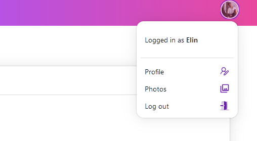
</details>

<br />

#### As user

<details><summary>- Browse other users via different filters.</summary>
    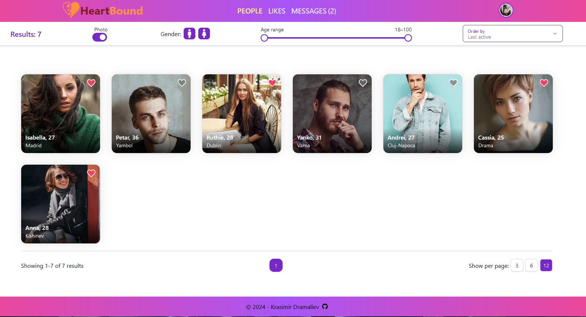
</details>

<details><summary>- Like/unlike other users.</summary>
    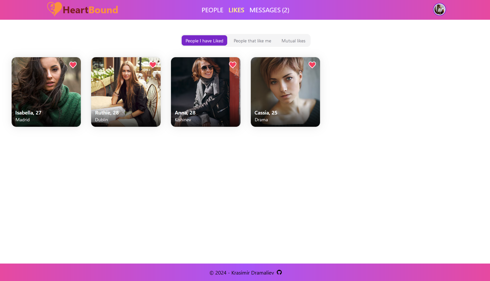
</details>

<details><summary>- Send messages to other users.</summary>
    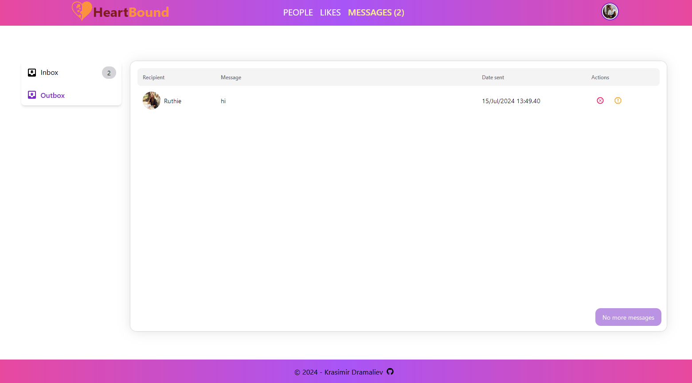
</details>

<details><summary>- Live chat with other users.</summary>
    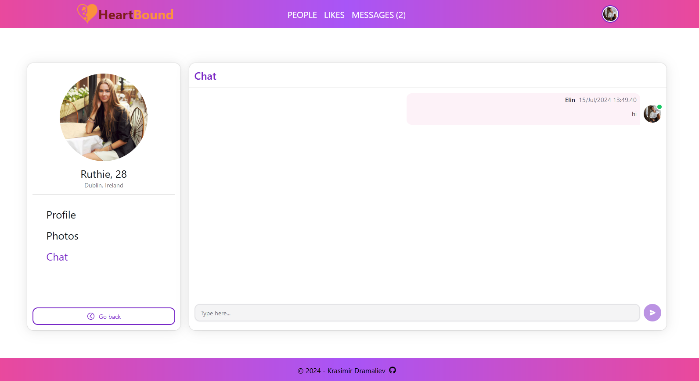
</details>

<details><summary>- Upload images</summary>
    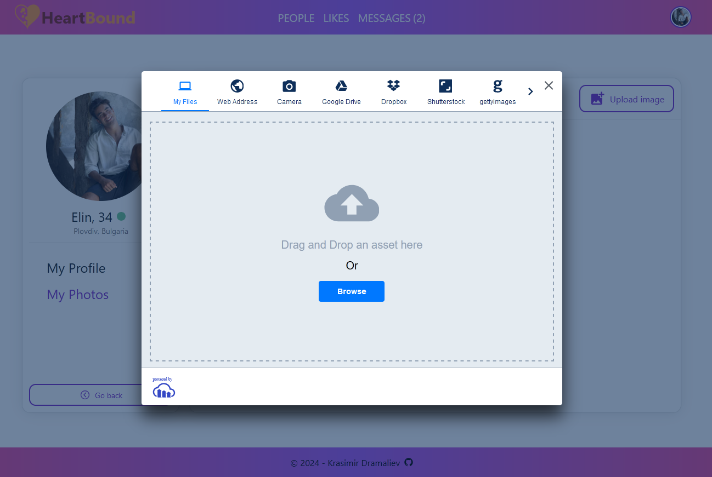
</details>

<details><summary>- Delete/Report messages</summary>
    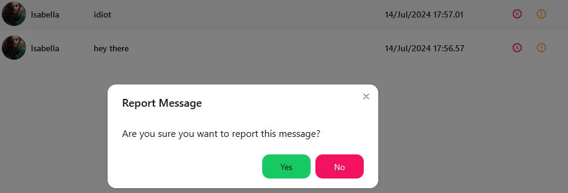
</details>

#### As Administrator

<details><summary>- Get Access to Server/Client sessions</summary>
    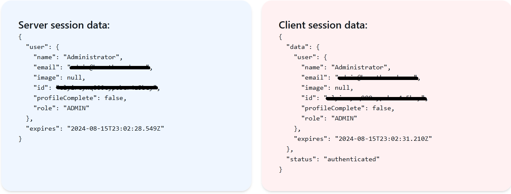
</details>

<details><summary>- Moderate `user photos`</summary>
    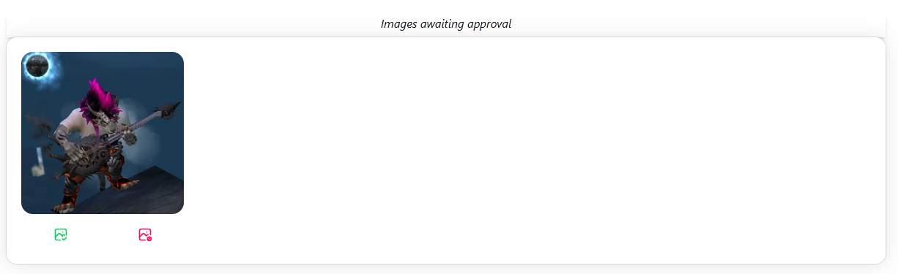
</details>

<details><summary>- Moderate `reported messages`</summary>
    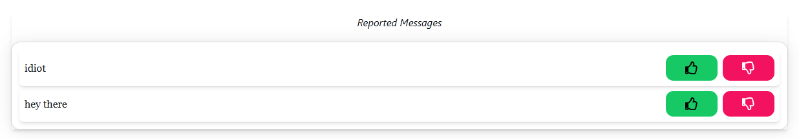
</details>

<details><summary>- Admin View</summary>
    
</details>

### Getting Started

#### As Developer
- Install Dependencies
    ```bash
    npm install
    ```

- Run development server:
    ```bash
    npm run dev
    ```

- PostgreDB as Docker Container set-up

    ```bash
    docker compose up -d
    ```

    ```bash
    npx prisma generate
    ```

    ```bash
    npx prisma db push
    ```

    ```bash
    npx prisma db seed
    ```
- Apply migrations + seed database
  
    ```bash
    npx prisma reset
    ```

- Run Prisma studio
  
    ```bash
    npx prisma studio
    ```

Open .env.example to understand what secrets do you need in your .env config file.

#### As User 

`N.B.:`
`You can register with your email and password, and your confirmation email will not be send, due to this, I highly recommend to use Github or Google as login at [https://heartbound.vercel.app](https://heartbound.vercel.app). Because of the nature of resend, which is my email-provider and its set-up only for testing as free version. You will also never receive email for reset-password functionality, due to same reason.`

<hr>
<details><summary>Registration (part 1)</summary>
    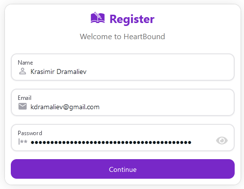
</details>

<details><summary>Registration (part 2)</summary>
    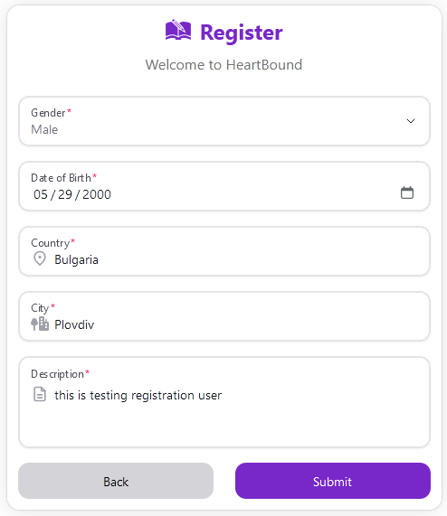
</details>

<details><summary>Registration (verification token in DB)</summary>
    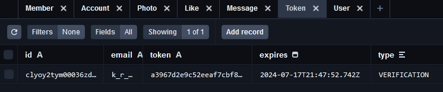
</details>

<details><summary>Verification Email</summary>
    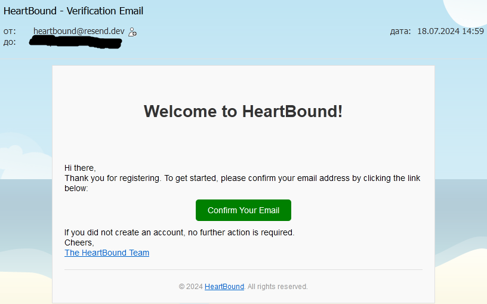
    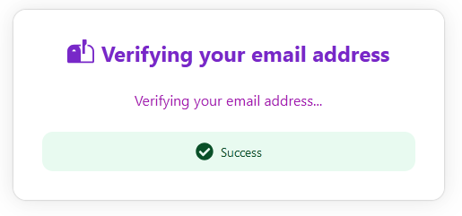
</details>

Login and use the app.

<details><summary>  - Login via Github</summary>
    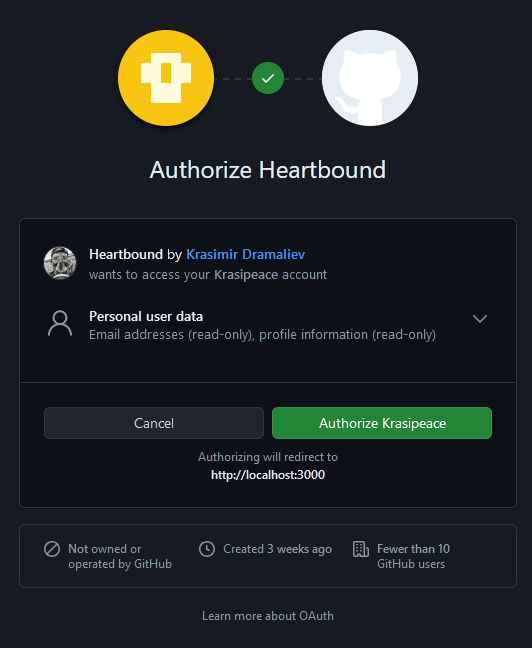
</details>

<details><summary>  - Login via Gitlab</summary>
    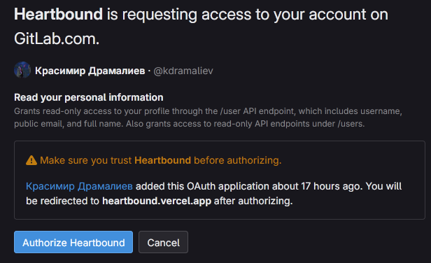
</details>

<details><summary>  - Login via Google(might still not work, because Google is verifying it)</summary>
    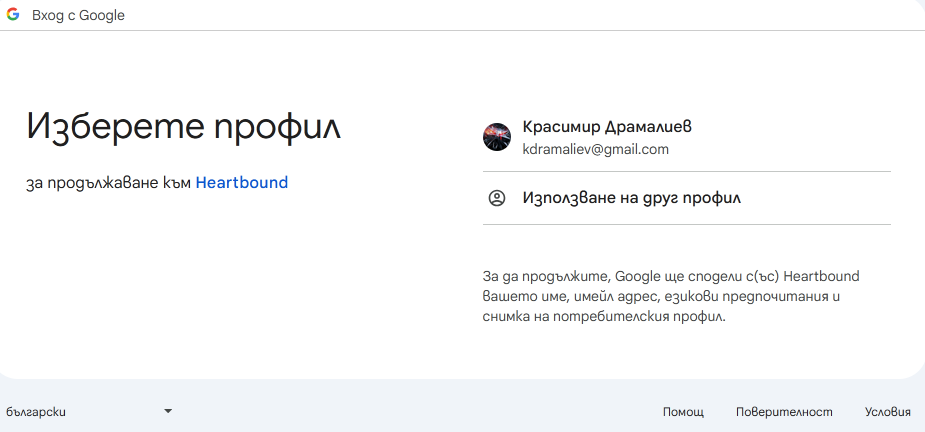
    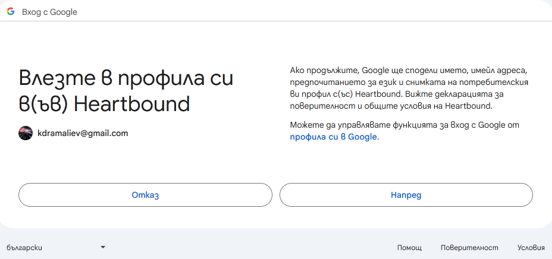
</details>

<details><summary>Finish Login with Social Acc</summary>
    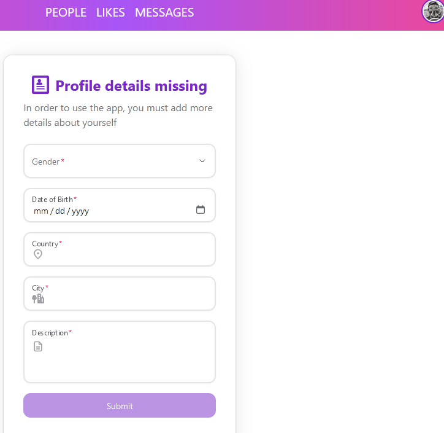
</details>

<br />

Login with test users info:
- TestUser1 - Anna:
  - Email: `anna@test.com`
  - Password: `testPassword`
- TestUser2 - Cassia:
  - Email: `cassia@test.com`
  - Password: `testPassword`
- TestUser3 - Andrei:
  - Email: `andrei@test.com`
  - Password: `testPassword`
- TestUser4 - Elin:
  - Email: `elin@test.com`
  - Password: `testPassword`

#### As Administrator

- Login as admin is not available at `heartbound.vercel.app`
- Locally, you can check [`.env.example`](.env.example) for the needed secrets in your `.env` config to seed and run your own administrator.

### Tech Stack / Libraries / Packages

- [Next.js](https://nextjs.org/)
- [NextUI](https://nextui.org/)
- [NextAuth.js](https://authjs.dev/getting-started/installation)
- [React](https://react.dev/)
- [React-Icons](https://react-icons.github.io/react-icons/)
- [React Hook Form](https://www.react-hook-form.com/)
- [React-Toastify](https://www.npmjs.com/package/react-toastify)
- [TailwindCSS](https://tailwindcss.com/)
- [Zod](https://zod.dev/)
- [PrismaORM](https://authjs.dev/getting-started/adapters/prisma)
- [bcrypt.js](https://www.npmjs.com/package/bcryptjs)
- [Docker](https://www.docker.com/)
- [Cloudinary](https://cloudinary.com/)
- [Pusher](https://pusher.com/)
- [Zustand](https://zustand-demo.pmnd.rs/)
- [Resend](https://resend.com/)

Test Users pictures from [freepik](https://www.freepik.com)
Home page gif created with [Canva](https://www.canva.com)

### Deploy on Vercel

App is deployed on Vercel at [link](https://heartbound.vercel.app).

[to top](#heartbound---dating-app)